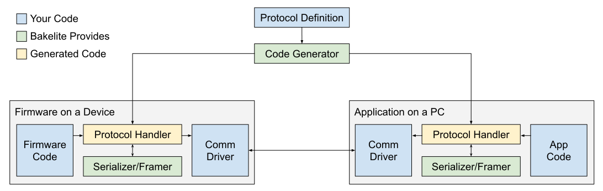

# Bakelite
Bakelite is a utility that makes it simple to communicate with your firmware.
Bakelite uses a code generator to automate the tedious process of hand building your own protocol.
It includes features like framing, error detection, and a lightweight C++ implementation suitable for small microcontrollers.


## Features
* Compact, easy to understand data serialization format
* Simple message passing
* Built in framing and error detection
* Easy to integrate with Serial, TCP, USB, I2C, etc...
* Use only the parts you need
* Code generators for:
    * C++ (header only, no STL or memory allocation)
    * Python


## How Does it Work?

You start by creating a protocol definition file that describes the messages and fields you'd like to send. It also includes information about the protocol itself, like what kind of framing to use, and the maximum message length.

Here's an example:
```proto
struct TestMessage {
  message: string[128]
}

struct Ack {
  code: uint8
}

protocol {
  maxLength = 256
  framing = COBS
  crc = CRC8

  messageIds {
    TestMessage = 1
    Ack = 2
  }
}
```

Now that you've created the definition file, we can generate some code:
```bash
bakelite gen -l python -i my_proto.bakelite -o my_proto.py
```

And then use it to send a message over a serial port:
```python3
from proto import Protocol, TestMessage, Ack
import serial

# Open a serial port and send an Ack message
with serial.Serial(':COM1', 9600) as port:
  proto = Protocol(stream=port)
  proto.send(Ack(code=123))
```

Message serialization, framing, and error detection are all taken care of.
If you need something more customized, you can use any of the components independently.
Drop in your own CRC algorithm, use the framer with your own message format, or just use the serializer on it's own.

For a more complete example, have a look at the [Python/Arduino Example](https://github.com/brendan0powers/bakelite/tree/master/examples/arduino).

## Status
This project is in early development. The C++ implementation is currently WIP.
The API and data format are not stable, and will change without notice.
